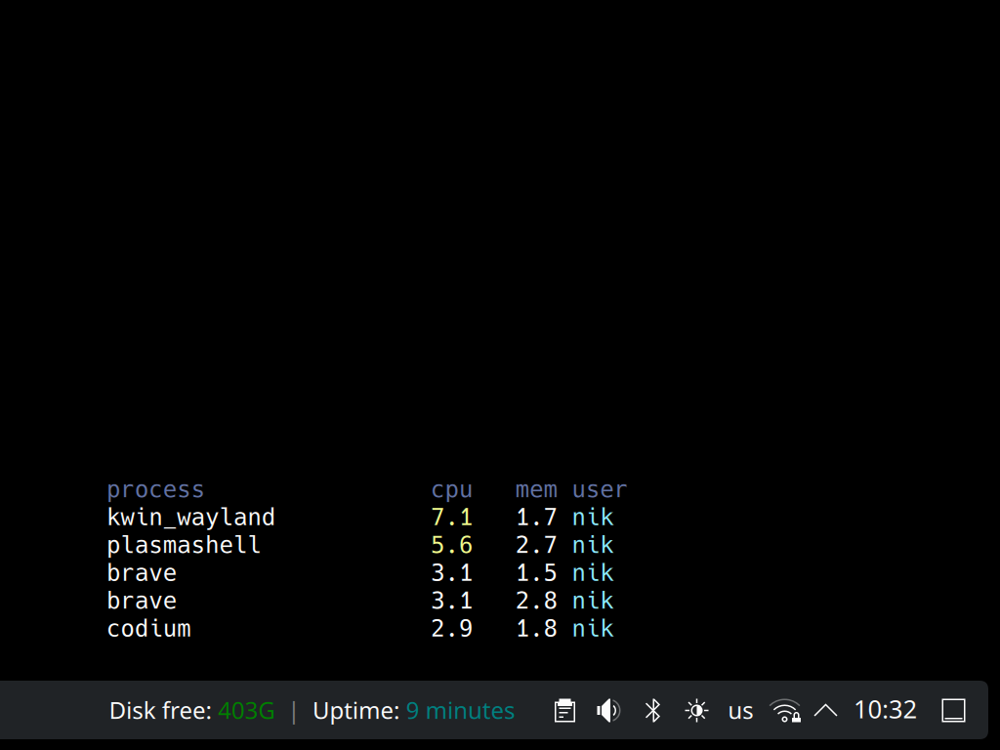

<p align="center">
  
</p>

<h1 align="center">Scriptoid</h1>

KDE Plasma widget that runs a shell command on a schedule and shows its output directly in your panel or on the desktop.

It is useful for small status scripts such as:

- current VPN or network state
- disk or memory usage
- weather from a CLI tool
- custom script output



## Features

- periodic command execution
- compact text output for panels and desktop
- optional ANSI color rendering
- configurable refresh interval, width mode, padding, font, color, and alignment
- optional separate tooltip command with its own refresh interval
- optional custom default tooltip text
- quick edit button for commands that point directly to local script files

## Install

Install directly from GitHub with a one-liner:

```bash
bash <(curl -fsSL https://raw.githubusercontent.com/khlesk/scriptoid/master/scripts/install)
```

For fish:

```fish
bash (curl -fsSL https://raw.githubusercontent.com/khlesk/scriptoid/master/scripts/install | psub)
```

After that, add **Scriptoid** from the Plasma widget picker.

## Configure

Open the widget settings and set a command, for example:

```bash
~/.local/share/scriptoid/examples/status
```

or:

```bash
~/.local/share/scriptoid/examples/top
```

The widget refreshes the command at the configured interval and displays either stdout or stderr when stdout is empty.

## Development

Clone the repository and enter the project directory:

```bash
git clone https://github.com/khlesk/scriptoid.git
cd scriptoid
```

Useful helper scripts:

- `./scripts/install`
- `./scripts/reinstall`
- `./scripts/uninstall`
- `./scripts/restart-plasmashell`

Example scripts live in `./examples`.
